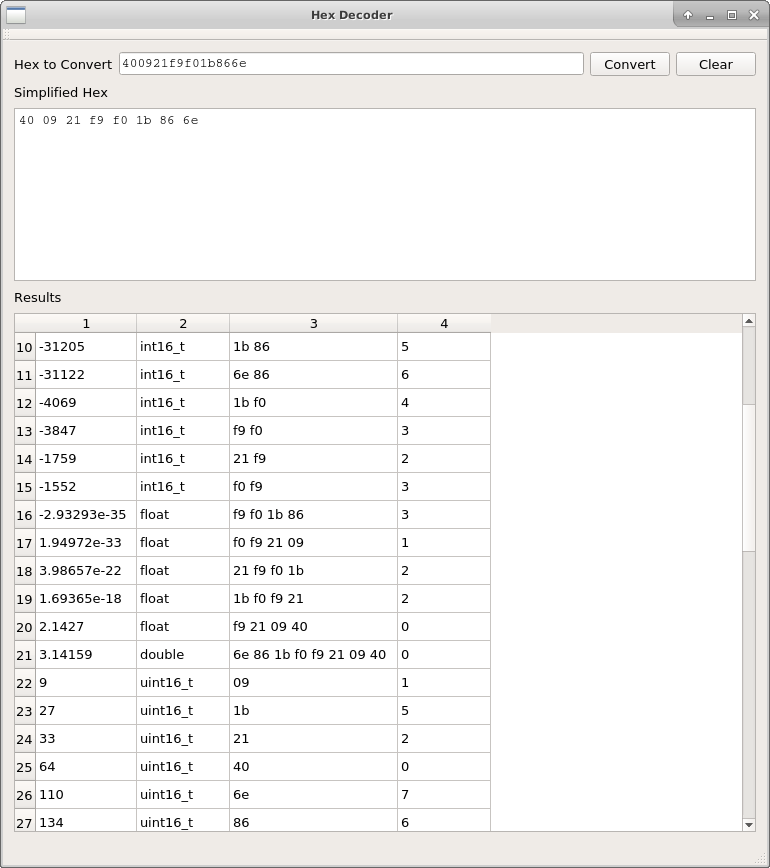

# security
ctf, binary utils, debugging, notes

## ctf

Various writeups

## utils

* aesSource : I implemented AES from source (and by lookup table).  Wanted a
  better understanding of how it worked and stuff for when I perform Reverse
  Engineering steps.

* caesar : A tool I created to help me solve caesar ciphers

* entropy : Two python utilities that were posted on the internet (not my own
  source) for determing entropy of a file (and a good indicator if a file is
  compressed or encrypted).  I realized after making this, binwalk has a -E 
  filename option that is great, graphs entropy and everything.

* FindFloats : Tool that will take raw hex, ignores extra non-hex characters,
  and dumps out all the possible values the hex could be converted to.  For
  instance, the hex below contained a constant of pi in it

* hex2bin : Converts a hex file (or standard input) into binary output (sends
  the output to stdout, so redirect it into a file if it is a non-ASCII hex.

* largest_block_size : If you have a bunch of files and you want to find out
  what is the largest block size that all the files could be evenly divided
  with.  (I have no idea why I created this...)

* ReverseCRC : Tool that will brute force determine all the possible CRC-8
  and CRC-16 seed values for an arbitrary blob of hexadecimal data.

* simpleFileEncryption : Makes is easy to use OpenSSL to encrypt files.
  Behaves like a copy command for a single file at a time.  Works on both
  Linux and Windows.

* xorFiles : xor the contents of 2 files into each other

