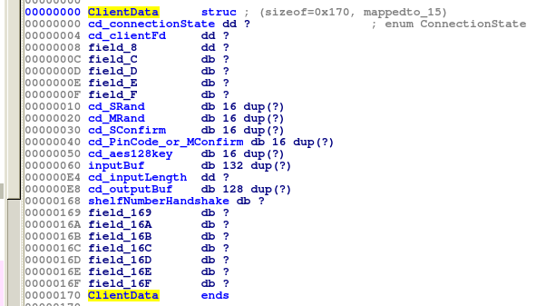

# smartfridge1

Tool to retrieve flag for the smartfridge1 reversing challenge for 33C3 CTF 2016

## Description of challenge

Description: We've developed a new smart refrigerator with networking functionality. We have
adopted the proven Bluetooth LE 4.0 crypto protocol to secure your food from your flatmates.
There are two lockable shelves. Shelf number 1 belongs to you. Find the fridge at (ip removed).
The pincode for your shelf is 768305. In it you will find the first flag.

* Note: this challenge is rate limited

Also was given a binary of the application that we could run ourselves and analyze

## Server Info

The port number of the server wasn't explicitly given, but it was available by nmap-ing the real
game server, executing netstat before and after running their instance, or static analysis.

I'm hesitant to trust binaries from unknown sources, so I ran my server in a VM, and did most of
my testing against it

## To compile and execute tool

Compilation:

>  g++ main.cpp -lcrypto -o fc

Execution:

>  ./fc 127.0.0.1 12345 1 12345

## Sample execution / output

Flags are stored on a remote server.  Below is the output of me running the application and getting the flag:

> mwales@Galaga:~/checkouts/security/ctf/33C3_2016/smartfridge1$ ./fc 123.123.123.123 12345 1 768305
> Shelf Num = 1
> Pin Code = 768305
> Pin Block:
> 31 b9 0b 00 00 00 00 00  00 00 00 00 00 00 00 00
>
> MRand:
> 00 11 22 33 44 55 66 77  88 99 aa bb cc dd ee ff
> 
> MConfirm:
> 3e b6 30 5f 6a 94 37 5c  63 e0 f3 fb c8 d0 e5 4e
> About to send the MConfirmMsg
> 15 00 00 00 01 3e b6 30  5f 6a 94 37 5c 63 e0 f3
> fb c8 d0 e5 4e 
> SConfigSize = 20
> b6 32 fc 16 23 a4 59 8b  28 18 b3 35 4a 70 98 99
> About to send the MRand
> 14 00 00 00 00 11 22 33  44 55 66 77 88 99 aa bb
> cc dd ee ff 
> SRand Received.  Msg Size = 20
> 8f 4b 0c ae f8 43 49 d3  ef ae 3f 40 b1 f0 d8 d0
> 
> Derived AES session key:
> a9 b6 59 b8 f9 b5 e7 02  89 2b 35 93 d8 4a e5 f2
> Enter a command (or exit to close client)
> Valid commands from reversing:
>   OPEN ShelfNumber              (use 1 or 2, needs to match the shelf number used at program startup)
>   LIST                          (lists contents of shelf, use OPEN first)
>   SHOW ItemNumber               (displays the item description)
>   PUT ItemNumber Name Desc      (adds an item to the shelf)
>   TAKE ItemNumber               (shows item, then removes from shelf)
>   CLOSE
> OPEN 1
> 
> Encrypting message of length 7, blocks required = 1, padding byte = 9
> No response expected for command: OPEN 1
> Enter a command (or exit to close client)
> Valid commands from reversing:
>   OPEN ShelfNumber              (use 1 or 2, needs to match the shelf number used at program startup)
>   LIST                          (lists contents of shelf, use OPEN first)
>   SHOW ItemNumber               (displays the item description)
>   PUT ItemNumber Name Desc      (adds an item to the shelf)
>   TAKE ItemNumber               (shows item, then removes from shelf)
>   CLOSE
> LIST
> 
> Encrypting message of length 5, blocks required = 1, padding byte = 11
> Response rx length = 52
> 5d cf 1e f3 cf 2b 48 3b  bb 84 aa 19 aa 07 20 10
> 6b 68 4b 3f 1f f3 08 6e  0c 75 1b 31 36 3f af 93
> 9e 6d 9b 79 31 c9 3f a1  01 47 c6 70 be 5f 45 5c
> 
> Decrypting Ciphertext:
> 5d cf 1e f3 cf 2b 48 3b  bb 84 aa 19 aa 07 20 10
> 6b 68 4b 3f 1f f3 08 6e  0c 75 1b 31 36 3f af 93
> 9e 6d 9b 79 31 c9 3f a1  01 47 c6 70 be 5f 45 5c
> Plaintext:
> 30 2e 20 74 6f 61 73 74  0a 31 2e 20 62 72 65 61
> 64 0a 32 2e 20 77 61 74  65 72 0a 33 2e 20 54 68
> 75 6e 66 69 73 63 68 0a  34 2e 20 0a 04 04 04 04
> Plaintext in ASCII:
> 0. toast
> 1. bread
> 2. water
> 3. Thunfisch
> 4. 
> 
> Enter a command (or exit to close client)
> Valid commands from reversing:
>   OPEN ShelfNumber              (use 1 or 2, needs to match the shelf number used at program startup)
>   LIST                          (lists contents of shelf, use OPEN first)
>   SHOW ItemNumber               (displays the item description)
>   PUT ItemNumber Name Desc      (adds an item to the shelf)
>   TAKE ItemNumber               (shows item, then removes from shelf)
>   CLOSE
> SHOW 0
> Encrypting message of length 7, blocks required = 1, padding byte = 9
> Response rx length = 52
> d4 fd b9 82 35 b2 6f d4  c0 84 3b b5 f2 e9 47 d8
> d7 58 fd b1 b3 c5 d1 0b  5b 04 4c 21 83 0b a2 44
> 73 d7 a0 48 d9 4c 18 bd  95 5b 07 73 35 d7 21 a2
> 
> Decrypting Ciphertext:
> d4 fd b9 82 35 b2 6f d4  c0 84 3b b5 f2 e9 47 d8
> d7 58 fd b1 b3 c5 d1 0b  5b 04 4c 21 83 0b a2 44
> 73 d7 a0 48 d9 4c 18 bd  95 5b 07 73 35 d7 21 a2
> Plaintext:
> 74 6f 61 73 74 3a 20 33  33 43 33 5f 73 31 69 6d
> 70 6c 33 5f 34 73 79 6e  63 5f 73 33 72 76 65 72
> 0a 0f 0f 0f 0f 0f 0f 0f  0f 0f 0f 0f 0f 0f 0f 0f
> Plaintext in ASCII:
> toast: 33C3_s1impl3_4sync_s3rver
> 
> Enter a command (or exit to close client)
> Valid commands from reversing:
>   OPEN ShelfNumber              (use 1 or 2, needs to match the shelf number used at program startup)
>   LIST                          (lists contents of shelf, use OPEN first)
>   SHOW ItemNumber               (displays the item description)
>   PUT ItemNumber Name Desc      (adds an item to the shelf)
>   TAKE ItemNumber               (shows item, then removes from shelf)
>   CLOSE
> exit
> 
> Encrypting message of length 5, blocks required = 1, padding byte = 11
> Response rx length = 48
> d4 fd b9 82 35 b2 6f d4  c0 84 3b b5 f2 e9 47 d8
> d7 58 fd b1 b3 c5 d1 0b  5b 04 4c 21 83 0b a2 44
> 73 d7 a0 48 d9 4c 18 bd  95 5b 07 73 
> Incoming cipher text length of 44 is invalid block size

I unfortunately didn't complete the CTF within the timelimit of the challenge.

## IDA Reversing Highlights

The binary wasn't stripped for this challenge, so many symbols were available during reversing.

### Before Reversing Started 

```C++
__int64 __usercall handle@<rax>(char *a1@<rbp>, unsigned int a2@<edi>)
{
  __int64 i; // rbx@1
  unsigned int v3; // eax@2
  unsigned int v4; // er13@3
  unsigned int v5; // ebp@6
  __int64 result; // rax@7
  unsigned __int8 v7; // al@8
  char *v8; // rax@10
  unsigned int v9; // eax@12
  bool v10; // cf@14
  bool v11; // zf@14
  bool v12; // cf@15
  bool v13; // zf@15
  char v14; // al@18
  __int64 v15; // rdx@19
  __int64 v16; // rdx@19
  __int64 v17; // rdx@24
  __int64 v18; // rdx@26
  const char *v19; // rdi@30
  signed __int64 v20; // rcx@30
  char *v21; // rsi@30
  char *v22; // r13@34
  int v23; // eax@35
  const char *v24; // rdi@38
  signed __int64 v25; // rcx@38
  char *v26; // rsi@38
  bool v27; // dl@41
  bool v28; // al@41
  bool v29; // cf@41
  bool v30; // zf@41
  signed int v31; // er15@42
  int v32; // er13@42
  const char *v33; // rdi@46
  signed __int64 v34; // rcx@46
  char *v35; // rsi@46
  bool v36; // dl@49
  bool v37; // al@49
  bool v38; // cf@49
  bool v39; // zf@49
  char *v40; // rax@50
  int v41; // eax@51
  const char *v42; // rdi@54
  signed __int64 v43; // rcx@54
  char *v44; // rsi@54
  char *v45; // rax@58
  int v46; // eax@59
  int v47; // er13@59
  _QWORD *v48; // rax@61
  bool v49; // cf@62
  bool v50; // zf@62
  char *v51; // rax@66
  int v52; // er13@67
  char *v53; // r15@68
  _BYTE *v54; // rdi@71
  const char *v55; // rdi@73
  signed __int64 v56; // rcx@73
  char *v57; // rsi@73
  __int64 v58; // rcx@96
  char *v59; // [rsp+8h] [rbp-170h]@70
  __int64 v60; // [rsp+10h] [rbp-168h]@28
  __int64 v61; // [rsp+18h] [rbp-160h]@28
  char s1; // [rsp+20h] [rbp-158h]@24
  char v63; // [rsp+2Fh] [rbp-149h]@43
  int buf; // [rsp+30h] [rbp-148h]@19
  __int64 v65; // [rsp+34h] [rbp-144h]@19
  __int64 v66; // [rsp+3Ch] [rbp-13Ch]@19
  __int64 v67; // [rsp+138h] [rbp-40h]@1

  v67 = *MK_FP(__FS__, 40LL);
  for ( i = (__int64)*(&clients + a2); ; *(_QWORD *)(i + 8) = 0LL )
  {
    while ( 1 )
    {
      while ( 1 )
      {
        while ( 1 )
        {
          while ( 1 )
          {
            do
            {
              while ( 1 )
              {
                while ( 1 )
                {
                  while ( 1 )
                  {
                    v3 = *(_DWORD *)(i + 228);
                    if ( v3 <= 3 )
                    {
                      result = 1LL;
                      goto LABEL_96;
                    }
                    v4 = *(_DWORD *)(i + 96);
                    if ( v4 > 0x84 )
                    {
                      result = 0LL;
                      goto LABEL_96;
                    }
                    if ( v3 < v4 )
                    {
                      result = 1LL;
                      goto LABEL_96;
                    }
                    __printf_chk(1LL, "Valid packet of size %d received\n", v4);
                    if ( *(_DWORD *)i > 1u )
                    {
                      v5 = v4 - 4;
                      if ( ((_BYTE)v4 - 4) & 0xF )
                      {
                        puts("Invalid message length");
                        result = 0LL;
                        goto LABEL_96;
                      }
                      decrypt(i + 80, i + 100, v5, i + 232);
                      v7 = *(_BYTE *)(i + v4 - 5 + 232);
                      if ( v7 > 0x10u )
                      {
                        puts("Invalid padding");
                        result = 0LL;
                        goto LABEL_96;
                      }
                      *(_BYTE *)(i + v5 - v7 + 232) = 0;
                      v8 = strtok((char *)(i + 232), " ");
                      a1 = v8;
                      if ( !v8 )
                      {
                        result = 0LL;
                        goto LABEL_96;
                      }
                      __printf_chk(1LL, "Command: %s\n", v8);
                    }
                    memmove((void *)(i + 96), (const void *)(i + 96 + v4), *(_DWORD *)(i + 228) - v4);
                    *(_DWORD *)(i + 228) -= v4;
                    v9 = *(_DWORD *)i;
                    if ( *(_DWORD *)i != 1 )
                      break;
                    if ( v4 <= 0x13 )
                      goto LABEL_29;
                    v17 = *(_QWORD *)(i + 108);
                    *(_QWORD *)(i + 32) = *(_QWORD *)(i + 100);
                    *(_QWORD *)(i + 40) = v17;
                    puts("Received MRand");
                    c1(7LL * (*(unsigned __int8 *)(i + 360) - 1) + 6305328, i + 32, &s1);
                    if ( memcmp(&s1, (const void *)(i + 64), 0x10uLL) )
                    {
                      puts("Invalid pincode");
LABEL_29:
                      result = 0LL;
                      goto LABEL_96;
                    }
                    puts("MConfirm validated");
                    buf = 20;
                    v18 = *(_QWORD *)(i + 24);
                    v65 = *(_QWORD *)(i + 16);
                    v66 = v18;
                    if ( send(*(_DWORD *)(i + 4), &buf, 0x14uLL, 0) <= 19 )
                    {
                      perror("Unable to send()");
                      goto LABEL_29;
                    }
                    puts("Sent SRand");
                    v60 = strtoll((const char *)(7LL * (*(unsigned __int8 *)(i + 360) - 1) + 6305328), 0LL, 10);
                    v61 = 0LL;
                    ::s1(&v60, i + 16, i + 32, i + 80);
                    *(_DWORD *)i = 2;
                    puts("Paired");
                  }
                  if ( v9 >= 1 )
                    break;
                  if ( v4 <= 0x14 )
                    goto LABEL_22;
                  v14 = *(_BYTE *)(i + 100);
                  if ( (unsigned __int8)(v14 - 1) > 1u )
                    goto LABEL_22;
                  *(_BYTE *)(i + 360) = v14;
                  v15 = *(_QWORD *)(i + 109);
                  *(_QWORD *)(i + 64) = *(_QWORD *)(i + 101);
                  *(_QWORD *)(i + 72) = v15;
                  puts("Received MConfirm");
                  c1(7LL * (*(unsigned __int8 *)(i + 360) - 1) + 6305328, i + 16, i + 48);
                  buf = 20;
                  v16 = *(_QWORD *)(i + 56);
                  v65 = *(_QWORD *)(i + 48);
                  v66 = v16;
                  if ( send(*(_DWORD *)(i + 4), &buf, 0x14uLL, 0) <= 19 )
                  {
                    perror("Unable to send()");
LABEL_22:
                    result = 0LL;
                    goto LABEL_96;
                  }
                  puts("Sent SConfirm");
                  *(_DWORD *)i = 1;
                }
                v10 = v9 < 2;
                v11 = v9 == 2;
                if ( v9 != 2 )
                  break;
                v19 = "OPEN";
                v20 = 5LL;
                v21 = a1;
                do
                {
                  if ( !v20 )
                    break;
                  v10 = (unsigned __int8)*v21 < *v19;
                  v11 = *v21++ == *v19++;
                  --v20;
                }
                while ( v11 );
                if ( (!v10 && !v11) != v10 )
                {
                  result = 0LL;
                  goto LABEL_96;
                }
                v22 = strtok(0LL, " ");
                __printf_chk(1LL, "Option: %s\n", v22);
                if ( !v22 )
                {
                  result = 0LL;
                  goto LABEL_96;
                }
                v23 = (unsigned __int8)*v22 - 48;
                if ( (unsigned int)v23 > 2 )
                {
                  result = 0LL;
                  goto LABEL_96;
                }
                if ( v23 != *(unsigned __int8 *)(i + 360) )
                {
                  result = 0LL;
                  goto LABEL_96;
                }
                *(_QWORD *)(i + 8) = 400LL * v23 + 6304128;
                *(_DWORD *)i = 3;
              }
              v12 = v9 < 3;
              v13 = v9 == 3;
            }
            while ( v9 != 3 );
            v24 = "LIST";
            v25 = 5LL;
            v26 = a1;
            do
            {
              if ( !v25 )
                break;
              v12 = (unsigned __int8)*v26 < *v24;
              v13 = *v26++ == *v24++;
              --v25;
            }
            while ( v13 );
            v27 = !v12 && !v13;
            v28 = v12;
            v29 = v27 < (unsigned __int8)v12;
            v30 = v27 == v28;
            if ( v27 != v28 )
              break;
            memset(&buf, 0, 0x100uLL);
            v31 = 48;
            v32 = 0;
            do
            {
              *(&v63 + strlen((const char *)&buf) + 1) = v31;
              __strcat_chk(&buf, ". ", 256LL);
              __strcat_chk(&buf, *(_QWORD *)(i + 8) + 80LL * v32, 256LL);
              __strcat_chk(&buf, "\n", 256LL);
              ++v32;
              ++v31;
            }
            while ( v32 != 5 );
            result = send_message(i, &buf);
            if ( !(_BYTE)result )
              goto LABEL_96;
          }
          v33 = "SHOW";
          v34 = 5LL;
          v35 = a1;
          do
          {
            if ( !v34 )
              break;
            v29 = (unsigned __int8)*v35 < *v33;
            v30 = *v35++ == *v33++;
            --v34;
          }
          while ( v30 );
          v36 = !v29 && !v30;
          v37 = v29;
          v38 = v36 < (unsigned __int8)v29;
          v39 = v36 == v37;
          if ( v36 != v37 )
            break;
          v40 = strtok(0LL, " ");
          if ( !v40 )
          {
            result = 0LL;
            goto LABEL_96;
          }
          v41 = (unsigned __int8)*v40 - 48;
          if ( (unsigned int)v41 > 4 )
          {
            result = 0LL;
            goto LABEL_96;
          }
          result = send_item(i, *(_QWORD *)(i + 8) + 80LL * v41);
          if ( !(_BYTE)result )
            goto LABEL_96;
        }
        v42 = "TAKE";
        v43 = 5LL;
        v44 = a1;
        do
        {
          if ( !v43 )
            break;
          v38 = (unsigned __int8)*v44 < *v42;
          v39 = *v44++ == *v42++;
          --v43;
        }
        while ( v39 );
        if ( (!v38 && !v39) != v38 )
          break;
        v45 = strtok(0LL, " ");
        if ( !v45 )
        {
          result = 0LL;
          goto LABEL_96;
        }
        v46 = (unsigned __int8)*v45;
        v47 = v46 - 48;
        if ( (unsigned int)(v46 - 49) > 3 )
        {
          result = 0LL;
          goto LABEL_96;
        }
        result = send_item(i, *(_QWORD *)(i + 8) + 80LL * v47);
        if ( !(_BYTE)result )
          goto LABEL_96;
        v48 = (_QWORD *)(*(_QWORD *)(i + 8) + 80LL * v47);
        *v48 = 0LL;
        v48[9] = 0LL;
        memset(
          (void *)((unsigned __int64)(v48 + 1) & 0xFFFFFFFFFFFFFFF8LL),
          0,
          8LL * (((unsigned int)v48 - (((_DWORD)v48 + 8) & 0xFFFFFFF8) + 80) >> 3));
      }
      v49 = (unsigned __int8)*a1 < 0x50u;
      v50 = *a1 == 80;
      if ( *a1 != 80 )
        break;
      v49 = (unsigned __int8)a1[1] < 0x55u;
      v50 = a1[1] == 85;
      if ( a1[1] != 85 )
        break;
      v49 = (unsigned __int8)a1[2] < 0x54u;
      v50 = a1[2] == 84;
      if ( a1[2] != 84 )
        break;
      v49 = 0;
      v50 = a1[3] == 0;
      if ( a1[3] )
        break;
      v51 = strtok(0LL, " ");
      if ( !v51 )
      {
        result = 0LL;
        goto LABEL_96;
      }
      v52 = (unsigned __int8)*v51 - 48;
      if ( (unsigned int)v52 > 4 )
      {
        result = 0LL;
        goto LABEL_96;
      }
      v53 = strtok(0LL, " ");
      if ( !v53 )
      {
        result = 0LL;
        goto LABEL_96;
      }
      if ( strlen(v53) > 0xF )
      {
        result = 0LL;
        goto LABEL_96;
      }
      v59 = strtok(0LL, "");
      if ( strlen(v59) > 0x3F )
      {
        result = 0LL;
        goto LABEL_96;
      }
      v54 = (_BYTE *)(*(_QWORD *)(i + 8) + 80LL * v52);
      if ( !*v54 )
      {
        __strcpy_chk(v54, v53, 16LL);
        __strcpy_chk(*(_QWORD *)(i + 8) + 80LL * v52 + 16, v59, 64LL);
      }
    }
    v55 = "CLOSE";
    v56 = 6LL;
    v57 = a1;
    do
    {
      if ( !v56 )
        break;
      v49 = (unsigned __int8)*v57 < *v55;
      v50 = *v57++ == *v55++;
      --v56;
    }
    while ( v50 );
    if ( (!v49 && !v50) != v49 )
      break;
    *(_DWORD *)i = 2;
  }
  result = 0LL;
LABEL_96:
  v58 = *MK_FP(__FS__, 40LL) ^ v67;
  return result;
}
```

### After Reversing Completed

```C++
__int64 __usercall handle@<rax>(char *firstCommandToken@<rbp>, unsigned int a2@<edi>)
{
  struct ClientData *i; // rbx@1
  unsigned int dataBufLen; // eax@2
  unsigned int messageLengthField; // er13@3
  unsigned int v5; // ebp@6
  __int64 result; // rax@7
  unsigned __int8 v7; // al@8
  char *v8; // rax@10
  enum ConnectionState clientState; // eax@12
  bool v10; // cf@14
  bool isOpenCommand; // zf@14
  bool isShelfOpen; // cf@15
  bool isListCommand; // zf@15
  char v14; // al@18
  __int64 v15; // rdx@19
  __int64 v16; // rdx@19
  __int64 v17; // rdx@24
  __int64 v18; // rdx@26
  const char *v19; // rdi@30
  signed __int64 v20; // rcx@30
  char *v21; // rsi@30
  char *openCommand_shelfToken; // r13@34
  int openCommand_shelfNum; // eax@35
  const char *v24; // rdi@38
  signed __int64 listTokenLength; // rcx@38
  char *v26; // rsi@38
  bool v27; // dl@41
  bool v28; // al@41
  bool v29; // cf@41
  bool isShowCommand; // zf@41
  signed int v31; // er15@42
  int v32; // er13@42
  const char *v33; // rdi@46
  signed __int64 showCommandLength; // rcx@46
  char *v35; // rsi@46
  bool v36; // dl@49
  bool v37; // al@49
  bool v38; // cf@49
  bool isTakeCommand; // zf@49
  char *showCommand_shelfToken; // rax@50
  int showCommand_shelfNumber; // eax@51
  const char *v42; // rdi@54
  signed __int64 takeCommandLen; // rcx@54
  char *v44; // rsi@54
  char *takeCommand_shelfToken; // rax@58
  int v46; // eax@59
  int takeCommand_shelfNum; // er13@59
  _QWORD *v48; // rax@61
  bool v49; // cf@62
  bool v50; // zf@62
  char *v51; // rax@66
  int shelfNumber; // er13@67
  char *itemName; // r15@68
  _BYTE *v54; // rdi@71
  const char *v55; // rdi@73
  signed __int64 v56; // rcx@73
  char *v57; // rsi@73
  __int64 v58; // rcx@96
  char *itemText; // [rsp+8h] [rbp-170h]@70
  __int64 pinBlockHalf; // [rsp+10h] [rbp-168h]@28
  __int64 v61; // [rsp+18h] [rbp-160h]@28
  char s1; // [rsp+20h] [rbp-158h]@24
  char v63; // [rsp+2Fh] [rbp-149h]@43
  int buf; // [rsp+30h] [rbp-148h]@19
  __int64 v65; // [rsp+34h] [rbp-144h]@19
  __int64 v66; // [rsp+3Ch] [rbp-13Ch]@19
  __int64 v67; // [rsp+138h] [rbp-40h]@1

  v67 = *MK_FP(__FS__, 40LL);
  for ( i = (struct ClientData *)clients[(unsigned __int64)a2]; ; *(_QWORD *)&i->field_8 = 0LL )
  {
    while ( 1 )
    {
      while ( 1 )
      {
        while ( 1 )
        {
          while ( 1 )
          {
            do
            {
              while ( 1 )
              {
                while ( 1 )
                {
                  while ( 1 )
                  {
                    dataBufLen = i->cd_inputLength;
                    if ( dataBufLen <= 3 )
                    {
                      result = 1LL;
                      goto LABEL_96;
                    }
                    messageLengthField = *(_DWORD *)&i->inputBuf[0];
                    if ( messageLengthField > 0x84 )// Data buffer too long
                    {
                      result = 0LL;
                      goto LABEL_96;
                    }
                    if ( dataBufLen < messageLengthField )
                    {
                      result = 1LL;
                      goto LABEL_96;
                    }
                    __printf_chk(1LL, "Valid packet of size %d received\n", messageLengthField);
                    if ( i->cd_connectionState > 1u )
                    {
                      v5 = messageLengthField - 4;
                      if ( ((_BYTE)messageLengthField - 4) & 0xF )
                      {
                        puts("Invalid message length");
                        result = 0LL;
                        goto LABEL_96;
                      }
                      decrypt((__int64)i->cd_aes128key, (__int64)&i->inputBuf[4], v5, (__int64)i->cd_outputBuf);
                      v7 = i->inputBuf[messageLengthField + 131];
                      if ( v7 > 0x10u )
                      {
                        puts("Invalid padding");
                        result = 0LL;
                        goto LABEL_96;
                      }
                      i->cd_outputBuf[v5 - v7] = 0;
                      v8 = strtok(i->cd_outputBuf, " ");
                      firstCommandToken = v8;
                      if ( !v8 )
                      {
                        result = 0LL;
                        goto LABEL_96;
                      }
                      __printf_chk(1LL, "Command: %s\n", v8);
                    }
                    memmove(i->inputBuf, &i->inputBuf[messageLengthField], i->cd_inputLength - messageLengthField);
                    i->cd_inputLength -= messageLengthField;
                    clientState = i->cd_connectionState;
                    if ( i->cd_connectionState != ConnectionState_Sent_SConfirm )
                      break;
                    if ( messageLengthField <= 0x13 )
                      goto LABEL_29;
                    v17 = *(_QWORD *)&i->inputBuf[12];
                    *(_QWORD *)&i->cd_MRand[0] = *(_QWORD *)&i->inputBuf[4];
                    *(_QWORD *)&i->cd_MRand[8] = v17;
                    puts("Received MRand");
                    c1(
                      (const char *)(7LL * ((unsigned __int8)i->shelfNumberHandshake - 1) + 0x603630),
                      (__int64)i->cd_MRand,
                      (__int64)&s1);
                    if ( memcmp(&s1, i->cd_PinCode_or_MConfirm, 0x10uLL) )
                    {
                      puts("Invalid pincode");
LABEL_29:
                      result = 0LL;
                      goto LABEL_96;
                    }
                    puts("MConfirm validated");
                    buf = 20;
                    v18 = *(_QWORD *)&i->cd_SRand[8];
                    v65 = *(_QWORD *)&i->cd_SRand[0];
                    v66 = v18;
                    if ( send(i->cd_clientFd, &buf, 0x14uLL, 0) <= 19 )
                    {
                      perror("Unable to send()");
                      goto LABEL_29;
                    }
                    puts("Sent SRand");
                    pinBlockHalf = strtoll(
                                     (const char *)(7LL * ((unsigned __int8)i->shelfNumberHandshake - 1) + 6305328),
                                     0LL,
                                     10);
                    v61 = 0LL;
                    ::s1((__int64)&pinBlockHalf, (__int64)i->cd_SRand, (__int64)i->cd_MRand, (__int64)i->cd_aes128key);
                    i->cd_connectionState = 2;
                    puts("Paired");
                  }
                  if ( (unsigned int)clientState >= 1 )
                    break;
                  if ( messageLengthField <= 0x14 )
                    goto LABEL_22;
                  v14 = i->inputBuf[4];
                  if ( (unsigned __int8)(v14 - 1) > 1u )
                    goto LABEL_22;
                  i->shelfNumberHandshake = v14;
                  v15 = *(_QWORD *)&i->inputBuf[13];
                  *(_QWORD *)&i->cd_PinCode_or_MConfirm[0] = *(_QWORD *)&i->inputBuf[5];
                  *(_QWORD *)&i->cd_PinCode_or_MConfirm[8] = v15;
                  puts("Received MConfirm");
                  c1(
                    (const char *)(7LL * ((unsigned __int8)i->shelfNumberHandshake - 1) + 6305328),
                    (__int64)i->cd_SRand,
                    (__int64)i->cd_SConfirm);
                  buf = 20;
                  v16 = *(_QWORD *)&i->cd_SConfirm[8];
                  v65 = *(_QWORD *)&i->cd_SConfirm[0];
                  v66 = v16;
                  if ( send(i->cd_clientFd, &buf, 0x14uLL, 0) <= 19 )
                  {
                    perror("Unable to send()");
LABEL_22:
                    result = 0LL;
                    goto LABEL_96;
                  }
                  puts("Sent SConfirm");
                  i->cd_connectionState = 1;
                }
                v10 = (unsigned int)clientState < 2;
                isOpenCommand = clientState == 2;
                if ( clientState != 2 )
                  break;
                v19 = "OPEN";
                v20 = 5LL;
                v21 = firstCommandToken;
                do
                {
                  if ( !v20 )
                    break;
                  v10 = (unsigned __int8)*v21 < *v19;
                  isOpenCommand = *v21++ == *v19++;
                  --v20;
                }
                while ( isOpenCommand );
                if ( (!v10 && !isOpenCommand) != v10 )
                {
                  result = 0LL;
                  goto LABEL_96;
                }
                openCommand_shelfToken = strtok(0LL, " ");
                __printf_chk(1LL, "Option: %s\n", openCommand_shelfToken);
                if ( !openCommand_shelfToken )
                {
                  result = 0LL;
                  goto LABEL_96;
                }
                openCommand_shelfNum = (unsigned __int8)*openCommand_shelfToken - '0';
                if ( (unsigned int)openCommand_shelfNum > 2 )
                {
                  result = 0LL;
                  goto LABEL_96;
                }
                if ( openCommand_shelfNum != (unsigned __int8)i->shelfNumberHandshake )
                {
                  result = 0LL;
                  goto LABEL_96;
                }
                *(_QWORD *)&i->field_8 = 400LL * openCommand_shelfNum + 6304128;
                i->cd_connectionState = 3;
              }
              isShelfOpen = (unsigned int)clientState < 3;
              isListCommand = clientState == 3;
            }
            while ( clientState != 3 );
            v24 = "LIST";
            listTokenLength = 5LL;
            v26 = firstCommandToken;
            do
            {
              if ( !listTokenLength )
                break;
              isShelfOpen = (unsigned __int8)*v26 < *v24;
              isListCommand = *v26++ == *v24++;
              --listTokenLength;
            }
            while ( isListCommand );
            v27 = !isShelfOpen && !isListCommand;
            v28 = isShelfOpen;
            v29 = v27 < (unsigned __int8)isShelfOpen;
            isShowCommand = v27 == v28;
            if ( v27 != v28 )
              break;
            memset(&buf, 0, 0x100uLL);
            v31 = 48;
            v32 = 0;
            do
            {
              *(&v63 + strlen((const char *)&buf) + 1) = v31;
              __strcat_chk(&buf, ". ", 256LL);
              __strcat_chk(&buf, *(_QWORD *)&i->field_8 + 0x50LL * v32, 256LL);
              __strcat_chk(&buf, "\n", 256LL);
              ++v32;
              ++v31;
            }
            while ( v32 != 5 );
            result = send_message((__int64)i, (const char *)&buf);
            if ( !(_BYTE)result )
              goto LABEL_96;
          }
          v33 = "SHOW";
          showCommandLength = 5LL;
          v35 = firstCommandToken;
          do
          {
            if ( !showCommandLength )
              break;
            v29 = (unsigned __int8)*v35 < *v33;
            isShowCommand = *v35++ == *v33++;
            --showCommandLength;
          }
          while ( isShowCommand );
          v36 = !v29 && !isShowCommand;
          v37 = v29;
          v38 = v36 < (unsigned __int8)v29;
          isTakeCommand = v36 == v37;
          if ( v36 != v37 )
            break;
          showCommand_shelfToken = strtok(0LL, " ");
          if ( !showCommand_shelfToken )
          {
            result = 0LL;
            goto LABEL_96;
          }
          showCommand_shelfNumber = (unsigned __int8)*showCommand_shelfToken - '0';
          if ( (unsigned int)showCommand_shelfNumber > 4 )
          {
            result = 0LL;
            goto LABEL_96;
          }
          result = send_item((__int64)i, (_BYTE *)(*(_QWORD *)&i->field_8 + 80LL * showCommand_shelfNumber));
          if ( !(_BYTE)result )
            goto LABEL_96;
        }
        v42 = "TAKE";
        takeCommandLen = 5LL;
        v44 = firstCommandToken;
        do
        {
          if ( !takeCommandLen )
            break;
          v38 = (unsigned __int8)*v44 < *v42;
          isTakeCommand = *v44++ == *v42++;
          --takeCommandLen;
        }
        while ( isTakeCommand );
        if ( (!v38 && !isTakeCommand) != v38 )
          break;
        takeCommand_shelfToken = strtok(0LL, " ");
        if ( !takeCommand_shelfToken )
        {
          result = 0LL;
          goto LABEL_96;
        }
        v46 = (unsigned __int8)*takeCommand_shelfToken;
        takeCommand_shelfNum = v46 - '0';
        if ( (unsigned int)(v46 - '1') > 3 )
        {
          result = 0LL;
          goto LABEL_96;
        }
        result = send_item((__int64)i, (_BYTE *)(*(_QWORD *)&i->field_8 + 80LL * takeCommand_shelfNum));
        if ( !(_BYTE)result )
          goto LABEL_96;
        v48 = (_QWORD *)(*(_QWORD *)&i->field_8 + 80LL * takeCommand_shelfNum);
        *v48 = 0LL;
        v48[9] = 0LL;
        memset(
          (void *)((unsigned __int64)(v48 + 1) & 0xFFFFFFFFFFFFFFF8LL),
          0,
          8LL * (((unsigned int)v48 - (((_DWORD)v48 + 8) & 0xFFFFFFF8) + 80) >> 3));
      }
      v49 = (unsigned __int8)*firstCommandToken < 'P';
      v50 = *firstCommandToken == 'P';
      if ( *firstCommandToken != 'P' )
        break;
      v49 = (unsigned __int8)firstCommandToken[1] < 'U';
      v50 = firstCommandToken[1] == 'U';
      if ( firstCommandToken[1] != 'U' )
        break;
      v49 = (unsigned __int8)firstCommandToken[2] < 'T';
      v50 = firstCommandToken[2] == 'T';
      if ( firstCommandToken[2] != 'T' )
        break;
      v49 = 0;
      v50 = firstCommandToken[3] == 0;
      if ( firstCommandToken[3] )
        break;
      v51 = strtok(0LL, " ");
      if ( !v51 )
      {
        result = 0LL;
        goto LABEL_96;
      }
      shelfNumber = (unsigned __int8)*v51 - '0';
      if ( (unsigned int)shelfNumber > 4 )
      {
        result = 0LL;
        goto LABEL_96;
      }
      itemName = strtok(0LL, " ");
      if ( !itemName )
      {
        result = 0LL;
        goto LABEL_96;
      }
      if ( strlen(itemName) > 0xF )
      {
        result = 0LL;
        goto LABEL_96;
      }
      itemText = strtok(0LL, "");
      if ( strlen(itemText) > 0x3F )
      {
        result = 0LL;
        goto LABEL_96;
      }
      v54 = (_BYTE *)(*(_QWORD *)&i->field_8 + 80LL * shelfNumber);
      if ( !*v54 )
      {
        __strcpy_chk(v54, itemName, 16LL);
        __strcpy_chk(*(_QWORD *)&i->field_8 + 80LL * shelfNumber + 16, itemText, 64LL);
      }
    }
    v55 = "CLOSE";
    v56 = 6LL;
    v57 = firstCommandToken;
    do
    {
      if ( !v56 )
        break;
      v49 = (unsigned __int8)*v57 < *v55;
      v50 = *v57++ == *v55++;
      --v56;
    }
    while ( v50 );
    if ( (!v49 && !v50) != v49 )
      break;
    i->cd_connectionState = 2;
  }
  result = 0LL;
LABEL_96:
  v58 = *MK_FP(__FS__, 40LL) ^ v67;
  return result;
}
```

And one of the key structures, was a structure that was used for each client that connected.





