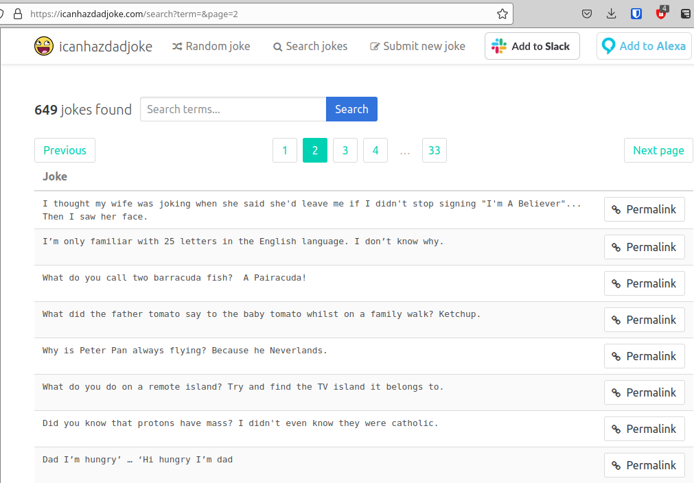

# Problem:

Welcome to Dad Wordle:

nc 0.cloud.chals.io 29788

Source: https://gist.github.com/AndyNovo/0c35d07b460609fd457a9d1c5b8663d1

Author: ProfNinja

# Solution

Reading the source, we are going to get a wordle like game with dad jokes.

From the source code given to us:

```
print("Jokes are Upperclass.  Thanks to icanhazdadjoke.com!")
#Jokes have been sanitized to be A-Z only, replacing non-alpha characters and replacing ñ with N
```

I also notice that the category for the challenge says OSINT.  So maybe I can
get a joke list from icanhazdadjoke.com.  I intially thoght I might have to
search for a joke with a letter or something, but I just happened to
accidentally click the search button, and it tells me there are 600 or so jokes
and I can browse through them a page at a time.  Page 2 of the joke list can
be easily queried through a URL with the page number variable:



So... 33 pages?  I play around with wget and curl.  For unknown reasons, when
download one of the pages with curl, it just gives you the jokes one line at
a time!  I thought I was going to have to parse though a bunch of messy HTML
tags and what not. Super easy to script up...

```
#!/bin/bash

for i in {1..33}
do
        echo "Sleepng before download page $i"
        sleep 5

        curl "https://icanhazdadjoke.com/search?term=&page=$i" -o page$i.txt
done
```

Combined all the joke pages into a single file, and then used a python script
to convert all the letters to uppercase, remove spaces, etc.  I even tossed in
the option via a command line argument that if you specified the number of
characters in your wordle, it will well tell you all the jokes that have that
exact number of characters.

```
#!/usr/bin/env python3

import sys

jokefile = open("combined_jokes.txt","r")
alljokes = jokefile.read().split("\n")
jokefile.close()

sys.stderr.write("Read in {} jokes\n".format(len(alljokes)))

sanijokelist = []

for curjoke in alljokes:
        sanijoke = ""
        for curchar in curjoke:
                if ( (curchar >= 'A') and (curchar <= 'Z') ):
                        sanijoke += curchar
                if ( (curchar >= 'a') and (curchar <= 'z') ):
                        sanijoke += (chr(ord(curchar) - ord('a') + ord('A')))

        if (len(sanijoke) > 10 ):
                print(sanijoke)
                sanijokelist.append(sanijoke)

if (len(sys.argv) >= 2):
        print("**************************************************************")
        print(" Jokes of specified length")
        print("**************************************************************")
        numletters = int(sys.argv[1])

        for curjoke in sanijokelist:
                if (numletters == len(curjoke) ):
                        print(curjoke)

```

Using this script, the wordle kids mode challenge can be solved using basic
wordle skills.  You get several guesses, and there is usually only a 10 or less
answers of the correct length. Just guess all of the possible answers, even if
you lose a game or two, you will eventually just win this way.  Or use reasoning
to win...

# Solving and Flag

```
$ nc 0.cloud.chals.io 29788
Jokes are Upperclass.  Thanks to icanhazdadjoke.com!
WELCOME TO DAD JOKE WORDLE: Your joke is 45 letters long. It starts with OU
Guess? >
```

So in another window, I run my script to see possible answers...

```
**************************************************************
 Jokes of specified length
**************************************************************
WHATDIDTHEPIECEOFBREADSAYTOTHEKNIFEBUTTERMEUP
WHATDIDTHEBIGFLOWERSAYTOTHELITTLERFLOWERHIBUD
OURWEDDINGWASSOBEAUTIFULEVENTHECAKEWASINTIERS
WHATDIDONENUTSAYASHECHASEDANOTHERNUTIMACASHEW
ILLTELLYOUWHATOFTENGETSOVERLOOKEDGARDENFENCES
WHATDOYOUCALLADICTIONARYONDRUGSHIGHDEFINITION
WHATDOYOUCALLABOOMERANGTHATWONTCOMEBACKASTICK
IJUSTWROTEABOOKONREVERSEPSYCHOLOGYDONOTREADIT
WHATDOYOUCALLAMAGICIANWHOHASLOSTTHEIRMAGICIAN
WHENDODOCTORSGETANGRYWHENTHEYRUNOUTOFPATIENTS
WHATDOYOUCALLANALLIGATORINAVESTANINVESTIGATOR
THANKSFOREXPLAININGTHEWORDMANYTOMEITMEANSALOT
THEINVENTIONOFTHEWHEELWASWHATGOTTHINGSROLLING
WHYDIDTHETREEGOTOTHEDENTISTITNEEDEDAROOTCANAL
AFARMERHADCOWSWHENHEROUNDEDTHEMUPHEFOUNDHEHAD
WHATDIDONEPLATESAYTOTHEOTHERPLATEDINNERISONME
IMREADINGABOOKONTHEHISTORYOFGLUECANTPUTITDOWN
```

Only one guess starts with the letters OU, EZ!

```
OURWEDDINGWASSOBEAUTIFULEVENTHECAKEWASINTIERS
You win the flag is UDCTF{S000_iPh0n3_ch4rg3rs_c4ll_3m_APPLE_JU1C3!}
```