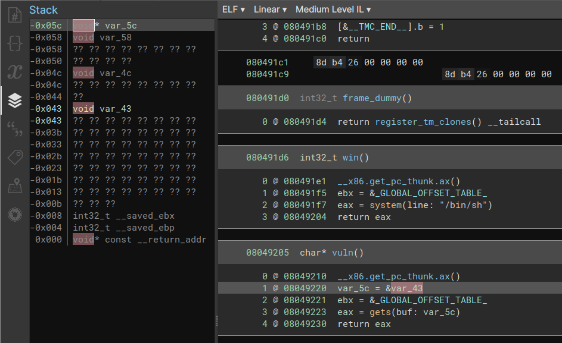

# Challenge

I really love the Sunshine CTF's Speedruns for teaching PWNing. This problem set is inspired by those.

#2. Control the Instruction Pointer

nc 0.cloud.chals.io 22209

Author: ProfNinja

Attachment: dist.zip

# Strategy

Need to overwrite the return address of the vuln function.  I find it easiest
to determine the number of padding bytes to put in my buffer by looking at
the Binary Ninja stack view.

I at first used the offset of the var_5c variable that Binary Ninja had at
stack offset -0x5c, which didn't work.  At second glance, var_5c is loaded 
with the address of var_43.

So make a buffer of padding characters 0x43 bytes long, then added the address
of the win function.  Running the script gets you a shell which you can then
cat the flag.
