# DEFCON Badge Challenge

It was my first trip to DEFCON, but was very excited to play with the infamous
electronic badges.  We were hanging out the first night at one of the tables
working on the badge outside the chillout room and tons of people came by to
see if we were making any progress hacking the badge, what they had figured out,
and ideas on moving forward.


The very first thing was to solder on headers to my board for the Simple Add On
and test out my add-on board that I made to support Ukraine.  I'll make a
writeup at some point about the add on.


I come from a background where I like to reverse engineer the software with a
tool like IDA Pro, Ghidra, or Binary Ninja.  So I went after the challenges
with that kind of approach.  Binary Ninja was my hammer, and everything was
looking like a nail.

There was a terrific
[badge writeup by Kybr](https://github.com/Kybr-git/DC30-Badge-Challenge-Writeup/blob/main/README.md)
posted on defcon subreddit by Kybr, which is probably a much more traditional
solve (with the intent to force you to meet other DEFCON attendees, walk around
DEFCON, etc). But if you want to see a more RE focused approach, continue 
reading.

# Identify Components

The first obvious that stands out is the CPU.  It has the symbol for the
Raspberry Pi on it.  It's not the usual Broadcom CPU that you see on most
Raspberry Pi's that run Linux, but the CPU from the smaller and very
inexpensive Raspberry Pi Pico.


There is also a component with the markings Winbond 25Q16JVNIQ. Searching the
internet reveals a
[Winbond W25Q16JV Serial NOR Flash](https://www.winbond.com/hq/product/code-storage-flash-memory/serial-nor-flash/?__locale=en&partNo=W25Q16JV) 
that has 16 megabits (2MB) of non-volatile memory.  Not sure if this is for
storing program data or other data (like those sweet 1 second audio samples you
can record with the badge).


Other components the badge has is the OLED screen that I've used in several
embedded projects (usually controlled via I2C or SPI bus), a speaker, 2 RGB LEDs,
6 tactile buttons (up, down, left, right, vol up, vol down), 12 piano buttons, 3
sample buttons, the Simple Add On port, audio line input, audio line output, and
USB micro port.

The faceplate that holds the speaker on the board can be removed and reversed.
It is kinda of a PITA to put back on, so I recommend just leaving it on.  Here are
some pictures of what mine looks like underneath.

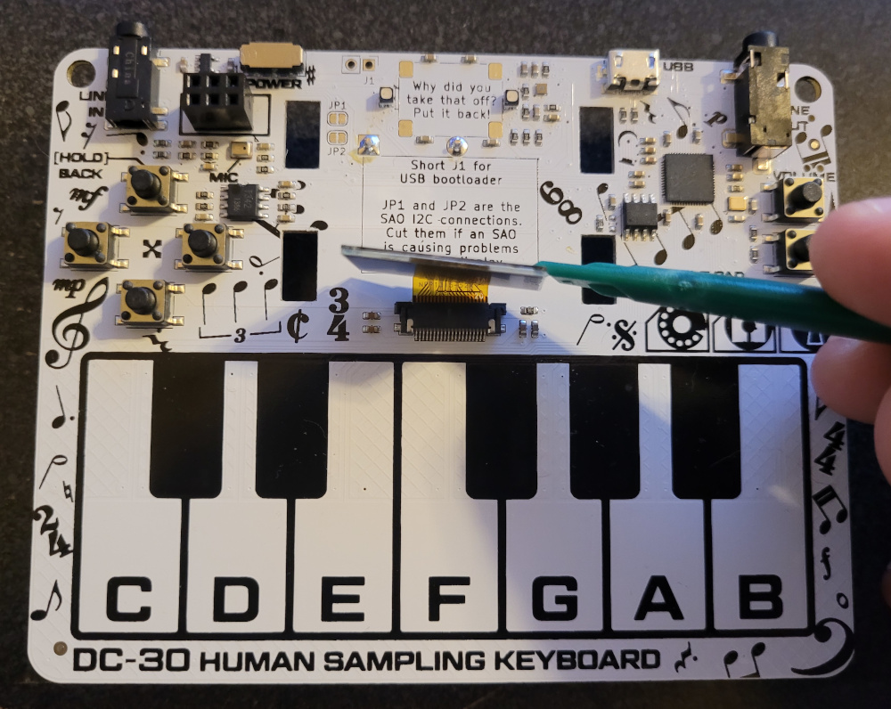

## Datasheets

* [RP2040 Datasheet](https://datasheets.raspberrypi.com/rp2040/rp2040-datasheet.pdf)
* [Winbond W25Q16JV NOR Flash](https://www.winbond.com/hq/support/documentation/downloadV2022.jsp?__locale=en&xmlPath=/support/resources/.content/item/DA00-W25Q16JV_1.html&level=1)

## Hardware Reversing

Since the microcontroller has exposed pins, we can try to trace some of the
more useful signals from the board.  When I first start this effort, I look at
the likely useful debug interfaces.  For this board, I was interested in
tracing out the connectivity of the following:

* J1 interface.  2 pins, .10" header right next to the speaker, underneath the
cover.  Possible Rx and Tx for a serial port?
* SAO interface.  6 pins, 2x3 .10" spacing.  The simple-add on specification
describes what some of the pins are.  Could the GPIO actually be a UART?  JTAG?
* 10 pin tiny connecter that is on the back of the board.

With a multi-meter in continuity mode, I set out to map some debug connectors.


## _Debug port on back of the badge_

```
     ─────
    /     \
   /  ┌─┐  \
  /   └─┘   \
 │           │
 │  ┌─┐ ┌─┐  │
 │  │1│ │a│  │
 │  └─┘ └─┘  │
 │           │
 │  ┌─┐ ┌─┐  │
 │  │2│ │9│  │
 │  └─┘ └─┘  │
 │           │
 │  ┌─┐ ┌─┐  │
 │  │3│ │8│  │
 │  └─┘ └─┘  │
 │           │
 │  ┌─┐ ┌─┐  │
 │  │4│ │7│  │
 │  └─┘ └─┘  │
 │           │
 │  ┌─┐ ┌─┐  │
 │  │5│ │6│  │
 │  └─┘ └─┘  │
 │           │
 │ ┌─┐   ┌─┐ │
 │ └─┘   └─┘ │
 │           │
 └───────────┘
```

Debug 2wire SWD

* Pin 2 = SWDIO
* Pin 4 = SWCLK


pins 5, 3, 9 and connected to J1 2

Might be possible to connect ARM debugger to the device and single-step through
the firmware!

## _SAO Connector_

(top of badge / power connector)

```
1 2 3
4 5 6

1 = 3.3V
4 = Ground
2 = GPIO 20
5 = GPIO 21

2 = JP1 
5 = JP2
```

Meh...  Not that interesting

## _J1 Connector_

J1 is a 3.3V power connector, it's connected to battery positive and ground. 
Probably for a bench-top DC supply during software development / board
troubleshooting.

# Figuring out badge functions

At some point I was given a clue that the badge would boot up into special modes
if certain button are held at startup.  There was also a note underneath the
screen that also indicated this.

* Self Test: Holding right button while powering on enables the self test
  feature. This will show you what buttons are pressed, and what keys of the
  keyboard have been pressed.  It also cycles the badge LEDs.

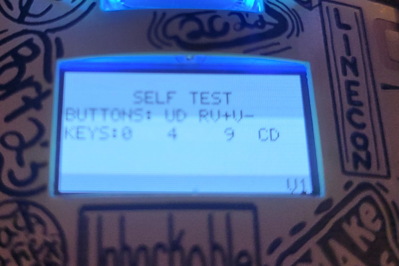

* Boot Select: Holding down while powering on.  Wasn't sure what this was at
  first, but the badge wouldn't boot up when in this mode.  We would later
  determine that this was the boot select mode.  In this mode, it will also
  appear as a USB storage device that had a small collection of files on it.
* USB Mode: If you booted the badge up while it's plugged into a PC, it would
  go straight to keyboard (bypassing the main menu) and at the top of the screen
  it showed a USB ID number.

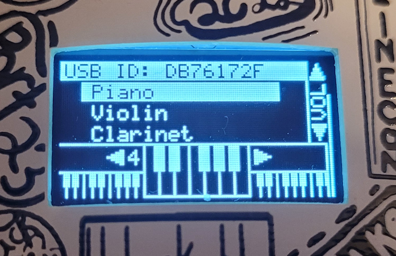

# Firmware Dumping

One of our co-workers told us that the we could dump the firmware with a tool
called picotool.  

To install the pico-sdk, I did the following steps.  There was a bit of trial
and error as we needed to get submodules before we could successfully build it.

```
git clone
cd 
git submodule update --init --recursive
mkdir build
cd build
cmake ..
make
```

With the pico-sdk built, you could then build the picotool. 

```
export PICO_SDK_PATH=/some/directory/pico-sdk
git clone
cd 
mkdir build
cd build
cmake ..
make
```

There are a bunch of options you could run picotool with, we eventually had
it dump the firmware for us by running the following command:

```
sudo ./picotool save -a flash.bin
```

# Importing into Binary Ninja

When we dumped the firmware, we could tell from picotool that we should tell
our reverse engineering tool that the ROM image starts at address 0x10000000.
You could also probably figure that out (or have some good starting guesses)
for the load address by reading the datasheet for the microcontroller.

We load the binary using Binary Ninja.  Just tell it the start address and
what kinda CPU / architecture the ROM belongs too.  It will then begin
an analysis.  When the analysis is complete, I like to look around some of the 
functions that the automatic analysis has picked out, and see if the functions
seem reasonable.  Do the functions jump to sane addresses, that also look like
sane functions.

It mostly looked OK, but I saw several references to address 0x20000000. I then
tried to make a new analysis with the ROM at that address to see if it looked
better or worse, and it looked worse at start address 0x20000000.

Decide that it is likely some other periphereal or memory device at that
address.  I guess RAM, and use the CPU manual to confirm.  Section 2.2 has the
address map of the SoC.

| Purpose          | Start Address |
| ---------------- | ------------- |
| ROM              | 0x00000000    |
| XIP              | 0x10000000    |
| SRAM             | 0x20000000    |
| APB Periphs      | 0x40000000    |
| AHB-Lite Periphs | 0x50000000    |
| IOPORT Regs      | 0xd0000000    |
| CortexM0 Regs    | 0xe0000000    |

This wasn't obvious how to get to work in Binary Ninja.  IDA Pro and Ghidra
have memory section editor, but I couldn't find it in Binary Ninja.  I asked on
the Binary Ninja support slack about it, and someone posted that the feature
had just been added to Binary Ninja recently, and that I would need to change
over to the dev branch to get the feature.  Awesome, just in time.

I'm not exactly sure how I was supposed to add an empty memory region.  What I
finally ended up doing was at the shell, dd-ing a block of zeros the size of the
RAM device I wanted, and then cat-ing that to the end of the ROM.

```
dd if=/dev/zero of=zeros.bin bs=1K count=256
cat flash.bin zeros.bin > flash_and_ram.bin
```

I could then add a new memory segment to the memory map editor at offset 0x200000 in
the ROM image, and start it at address 0x20000000 of the memory space.  The
first segment ends up with this memory too, but it doesn't seem to bother 
anythind and I didn't see a way to resize the first segment.

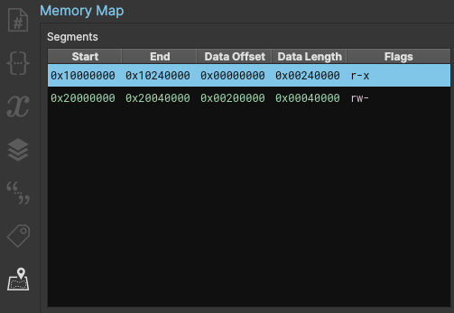

# Reversing tips

After opening the binary up, I wanted to look for what strings were used, and
how are they used.  Around address 0x0x1000d500 you can find a lot of strings
that are displayed on the screen in the tutorial and challenge screens.

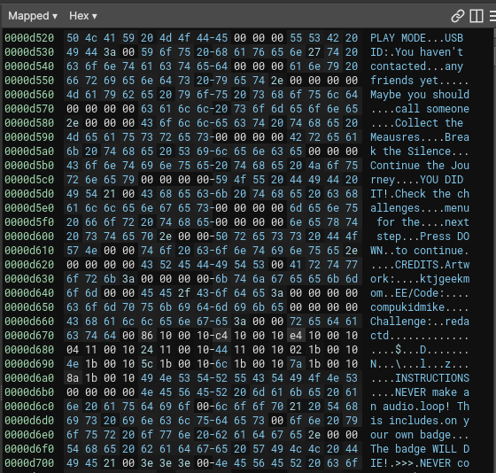

You can then infer that 0x1000503c is a oled_display(char* text, xcoord, ycoord,
bool inversion).  I've used similar displays from Adafruit and this is a pretty
standard sort of display routine you use a lot.  I was able to also reverse
engineer a bunch of other functions as I dug down into how the display function
worked:

| Address    | Function        | Notes                        |
| ---------- | --------------- | ---------------------------- |
| 0x1000d500 | oled_display    | char*, x, y, inversion       |
| 0x10004fc4 | oled_print_char | char, x, y, arg4unk          |
| 0x10004e14 | turn_pixel_on   | x, y                         |
| 0x10004eec | turn_pixel_off  | x, y                         |
| 0x100050d8 | draw_vert_line  | x, yStart, yEnd              |
| 0x10005074 | draw_rect       | xStart, yStart, xStop, yStop |
| 0x100050a6 | clear_rect      | xStart, yStart, xStop, yStop |
| 0x100050f6 | draw_horz_line  | xStart, xStop, y             |
| 0x10005114 | clear_vert_line | x, yStart, yStop             |
| 0x10005132 | clear_horz_line | xStart, xStop, y             |
| 0x10005150 | draw_bitmap     | lots of em                   |

The other function I found that used strings alot was some kind of assert
failure function at 0x10007548.  The users of this function seemed to be at
lower level code and this didn't seem to help my reversing efforts that much.

With the oled_display function known, you can begin to figure out a bunch of the
screens that pop up on the display based on what strings are displayed.

The function that displays the "SELF TEST" string is great for reversing how the
piano key presses are processed by the software.  The 16-bit word at 0x20026eea
is where piano key bits are stored (maybe an interrupt sets the bits in the
word.)  I didn't have to work out exactly where the hardware was read from.

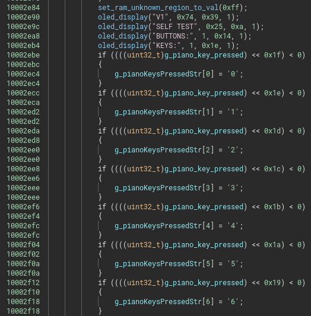

Keyboard:

```
 1 3   6 8 A
0 2 4 5 7 9 B
```

## Solving Challenge 1

Knowing what keys are pressed, and what screen displays the "YOU DID IT" and
congratulates the user on completing a challenge. Binary Ninja only shows 1
function that calls this function, leading us to the function that determines
if the song has been entered for the first challenge.

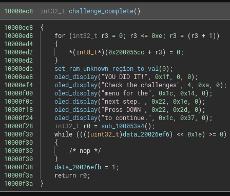

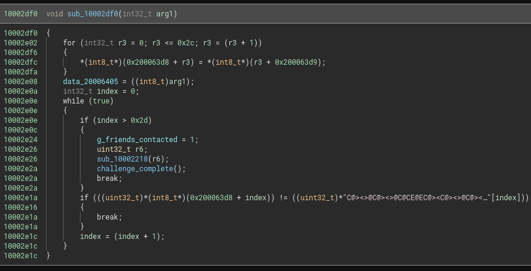

There is a buffer at 0x200063d8 that must get filled with characters to match
the buffer of 0x2d characters at 0x1000dac8.  This buffer looks like the
following in ASCII:

```
C@><>@C@><>@C@CE@EC@><C@><>@C@><>@>@C@CE@EGDB@
```

That mess of ascii is the following in hex:

```
C@><>@C@><>@C@CE@EC@><C@><>@C@><>@>@C@CE@EGDB@

 43 40 3e 3c 3e 40 43 40 3e 3c 3e 40 43 40 43 45  C@><>@C@><>@C@CE
 40 45 43 40 3e 3c 43 40 3e 3c 3e 40 43 40 3e 3c  @EC@><C@><>@C@><
 3e 40 3e 40 43 40 43 45 40 45 47 44 42 40        >@>@C@CE@EGDB@
```

By the time I had reversed this, somone had already told us what the song was
when they solved it by combining all the defcon badges together.  Since I kinda
generally knew what the notes were, I guessed this weird string had a mapping
to piano keys like the following:

12 face keys
* octave 1 = 0x00 - 0x0b
* octave 2 = 0x0c - 0x17
* octave 3 = 0x18 - 0x23
* octave 4 = 0x24 - 0x2f
* octave 5 = 0x30 - 0x3b
* octave 6 = 0x3c - 0x47

That analysis ends up off by 1 octave.  Maybe the badge software didn't want to
use value 0x0 or something?  The challenge solution has to be entered in using
octave 4 (you change octaves on the play screen by pressing L and R).

Disclaimer: I know nothing about music / octaves / notes.  This is just
combining what more musically knowledgeable people told me with what I reversed
out of the binary.

The face keys of the keyboard (there are 12 keys)

```
C, C#, D, D#, E, F, F#, F, G#, A, A#, B
```

For the octave that all the keys are in, the keys would be.

```
C, C#, D, D#, E, F, F#, G, G#, A, A#, B
3C 3D  3E 3F  40 41 42  43 44  45 46  47
```

Replacing the hex with the keys for the keyboard

```
 G  E  D  C  D  E  G  E  D  C  D  E  G  E  G  A
 E  A  G  E  D  C  G  E  D  C  D  E  G  E  D  C
 D  E  D  E  G  E  G  A  E  A  B  G# F# E
```

or for easier keyboarding...

```
 G  E  D  C
 D  E  G  E
 D  C  D  E
 G  E  G  A
 E  A  G  E
 D  C  G  E
 D  C  D  E
 G  E  D  C
 D  E  D  E
 G  E  G  A
 E  A  B  G#
 F# E
```

## Solving Challenge 2

So now the challenge menu option will give you a screen that says to "Call
Jenny", but the word JENNY is mirrored right to left.  We obviously tried to 
call [Jenny](https://youtube.com/watch?v=6WTdTwcmxyo)'s number 867-5309, we
to dial it backwards, we even tried to look up what would be Jenny's area code. 
We even had people tell us that you had to enter the number in the tempo of the
song...

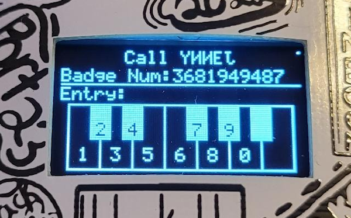

Getting nowhere, we turned back to the reverse engineering efforts and tried
to see if we could find Jenny's number that way.  There was also an entry for
"Friend" on the main menu, but it would say "You haven't contacted any friends
yet. Maybe you should call someone."

Since we had already reversed out the functions used to display things on the
screen we quickly found all the functions that displayed things on the screen,
and this challenge had a function at 0x100029bc, which I called call_jenny_mode.

In this function there was a basically a giant switch statement that was adding
ASCII digits to a char[11] buffer.  You could see that it would track how many
digits were added to the buffer so far, and would display the buffer on the
screen.  So that char[11] buffer at 0x200063c8 must be the phone number you are
trying to call.

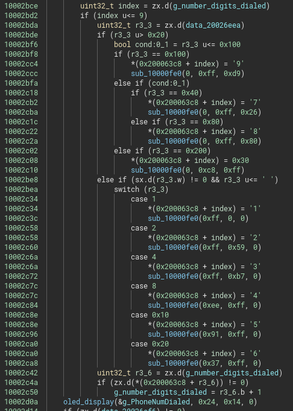

The function directly before this function looked really really suspicious as
well.  It had all these conditional branches, and each branch would say you
called a person.

It had the following people listed:
* Alice
* Bob
* Carol
* Dan
* Eve
* Trever (Forget?)

We tried dialing the number in the conditional that didn't work.  Which should
have been obvious, cause there was some stuff going on before the comparison.

The first part of the check_phone_number function (address 0x100026c0) is to
take the phone number the user entered and rotate the string left one digit.

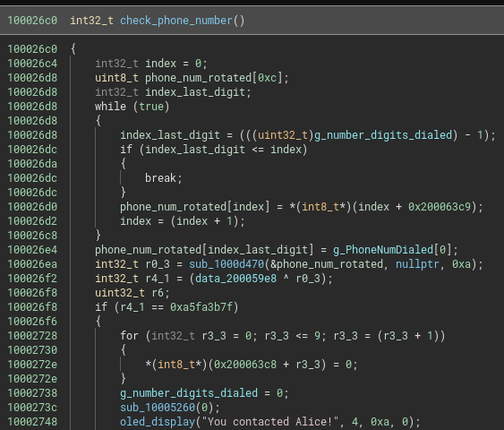

Where...
```
12345678
```

would become

```
23456781
```

I thought the code was just doing some hand-coded memcpy, and just overlooked
this.  Had I discerned this, I would have probably just tried this number XOR
against the badge number that they show you on this screen, and would have
completed this challenge a lot earlier than I did.  I tried these obvious things
without rotating the number, which fails, which then led me to reverse engineer
a bunch of other code before coming back to this section later (I was about to
hook up an ARM hardware debugger and step through this troublsome code).

I wasn't sure what function 0x1000d470 is, and I wasn't sure what was stored at
address 0x200059e8.

After reversing the usbIdDisplay function, I could tell that there was a string
stored at 0x20005ba4, which the software displayed as the USB ID.  One of the
boot modes will show this value, and you could see this value in lsusb and dmesg
when had the badge was plugged into a Linux PC.

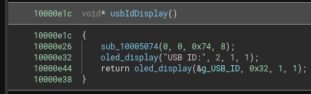

dmesg output generated from badge:

```
[1125811.847556] usb 1-4.1: USB disconnect, device number 64
[1125812.407672] usb 1-4.1: new full-speed USB device number 65 using xhci_hcd
[1125812.851663] usb 1-4.1: New USB device found, idVendor=dc30, idProduct=dc30, bcdDevice= 1.00
[1125812.851665] usb 1-4.1: New USB device strings: Mfr=1, Product=2, SerialNumber=3
[1125812.851666] usb 1-4.1: Product: DC30-DB76172F
[1125812.851667] usb 1-4.1: Manufacturer: MK Factor
[1125812.851668] usb 1-4.1: SerialNumber: E6619864DB76172F
```

When I followed the cross references for the address 0x200059e8 it brought me
to function at address 0x10003ad0, that I called main_setup.  This funcion has
a big while loop that calls all the other different mode functions that badge
runs. After doing some reversing in this function and cross-referencing
variabled, I was able to determine that 0x200059e8 is a UINT32 of the badge
number, which is also the USB ID (just not displayed as hexadecimal)

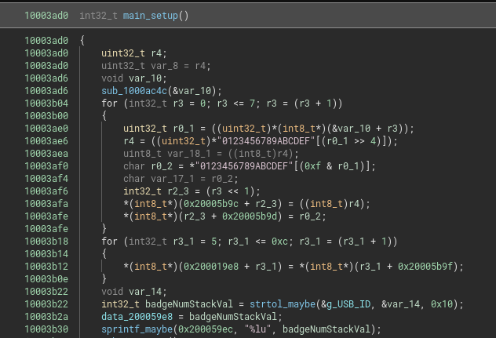

Going back to check_phone_number with everything reversed out, it's a lot easier
to see what the function does.  The phone number you enter gets rotated (in base
10), and then converted to an INT32 which is XOR against some hardcoded values
for each of the contacts.

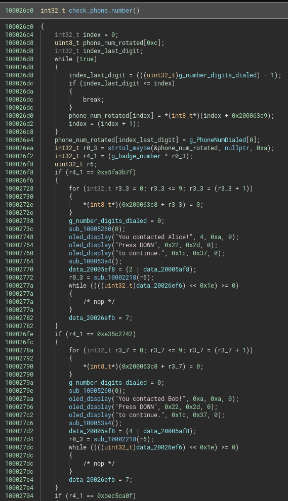

So each of the phone numbers you have to enter (unrotated) are:

```
>>> badgenum = 3681949487   # This changes for each badge
>>> alice = badgenum ^ 0xa5fa3b7f
>>> print(alice)
2123115600
>>> bob = badgenum ^ 0xe35c2742
>>> print(bob)
942289005
>>> carol = badgenum ^ 0xbec5ca0f
>>> print(carol)
1706286368
>>> dan = badgenum ^ 0x87e35d46
>>> print(dan)
1553287785
>>> eve = badgenum ^ 0x5acd14f9
>>> print(eve)
2176517078
>>> trevor = badgenum ^ 0xabde1fcf
>>> print(trevor)
1890060512
```

## Badge Finished

And now the contacts screen looks like the following with all the friends
contacted:

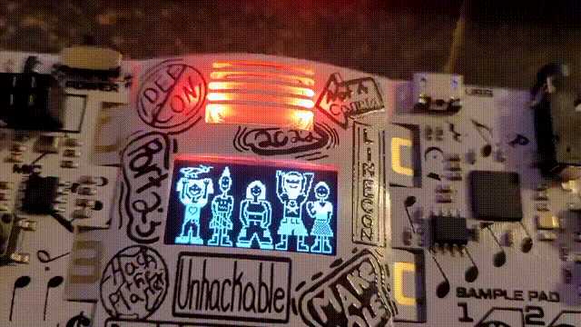
