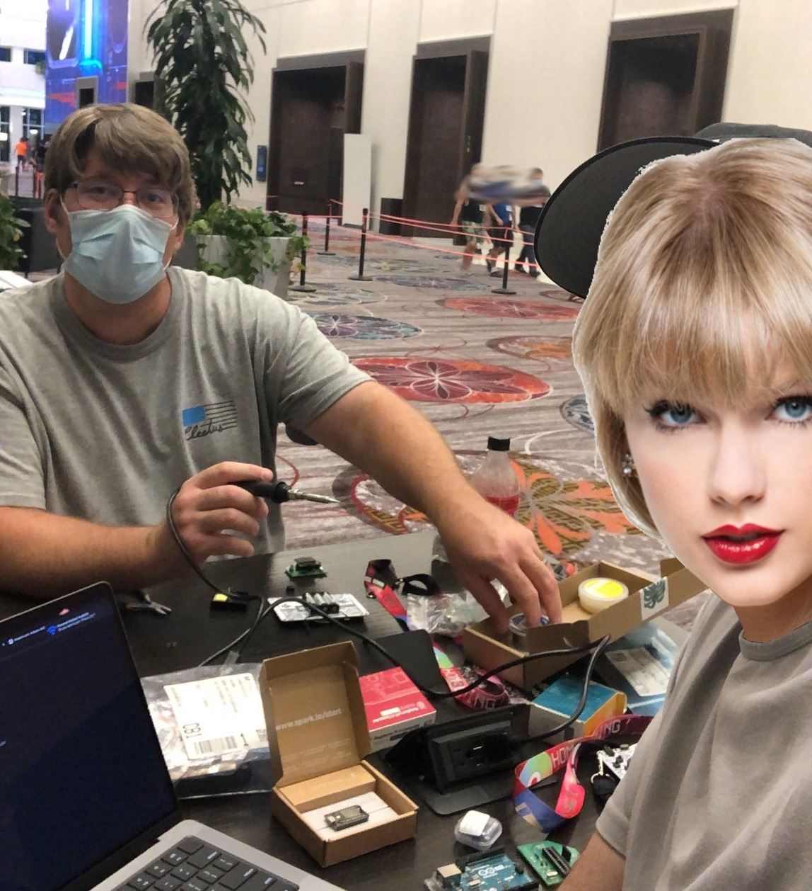
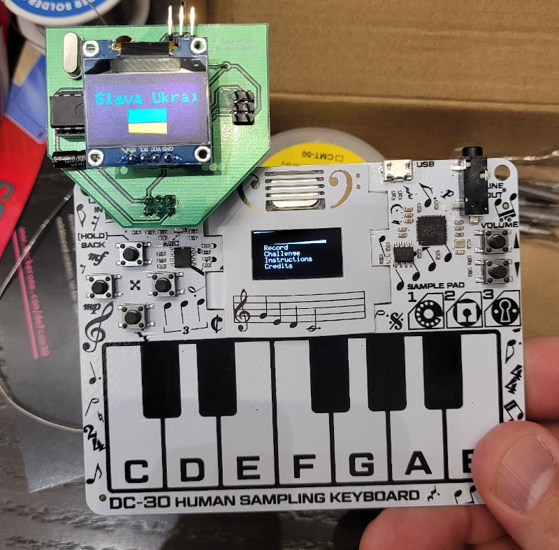
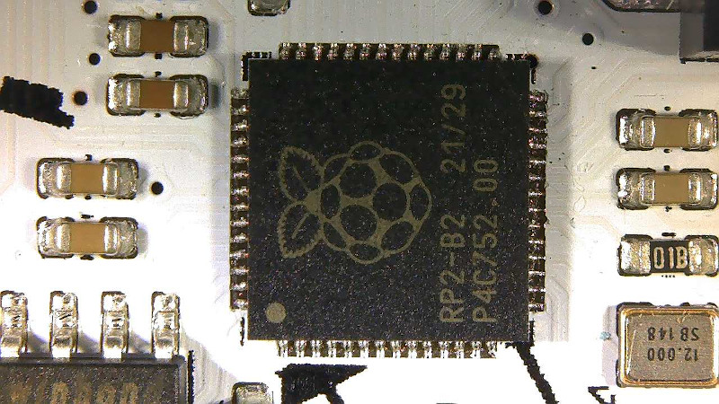
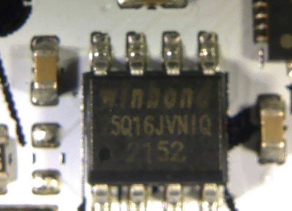

# DEFCON Badge Challenge

It was my first trip to DEFCON, but was very excited to play with the infamous
electronic badges.  We were hanging out the first night at one of the tables
working on the badge outside the chillout room and tons of people came by to
see if we were making any progress hacking the badge, what they had figured out,
and ideas on moving forward.



The very first thing was to solder on headers to my board for the Simple Add On
and test out my add-on board that I made to support Ukraine.  I'll make a
writeup at some point about the add on.



I come from a background where I like to reverse engineer the software with a
tool like IDA Pro, Ghidra, or Binary Ninja.  So I went after the challenges
with that kind of approach.  Binary Ninja was my hammer, and everything was
looking like a nail.

There was a terrific
[badge writeup by Kybr](https://github.com/Kybr-git/DC30-Badge-Challenge-Writeup/blob/main/README.md)
posted on defcon subreddit by Kybr, which is probably a much more traditional
solve (with the intent to force you to meet other DEFCON attendees, walk around
DEFCON, etc). But if you want to see a more RE focused approach, continue 
reading.

# Identify Components

The first obvious that stands out is the CPU.  It has the symbol for the
Raspberry Pi on it.  It's not the usual Broadcom CPU that you see on most
Raspberry Pi's that run Linux, but the CPU from the smaller and very
inexpensive Raspberry Pi Pico.



There is also a component with the markings Winbond 25Q16JVNIQ. Searching the
internet reveals a
[Winbond W25Q16JV Serial NOR Flash](https://www.winbond.com/hq/product/code-storage-flash-memory/serial-nor-flash/?__locale=en&partNo=W25Q16JV) 
that has 16 megabits (2MB) of non-volatile memory.  Not sure if this is for
storing program data or other data (like those sweet 1 second audio samples you
can record with the badge).



Other components the badge has is the OLED screen that I've used in several
embedded projects (usually controlled via I2C or SPI bus), a speaker, 2 RGB LEDs,
6 tactile buttons (up, down, left, right, vol up, vol down), 12 piano buttons, 3
sample buttons, the Simple Add On port, audio line input, audio line output, and
USB micro port.

The faceplate that holds the speaker on the board can be removed and reversed.
It was a huge PITA to put back on, so I recommend just leaving it on.  Here are
some pictures from the internet of what it looks like underneath.


## Datasheets

[RP2040 Datasheet](https://datasheets.raspberrypi.com/rp2040/rp2040-datasheet.pdf)
[Winbond W25Q16JV NOR Flash](https://www.winbond.com/hq/support/documentation/downloadV2022.jsp?__locale=en&xmlPath=/support/resources/.content/item/DA00-W25Q16JV_1.html&level=1)

Piano Keys, todo: where in binary did i figure this out? self test?

* 9 = 0x100
* 8 = 0x80
* 7 = 0x40
* 6 = 0x20
* 5 = 0x10
* 4 = 0x08
* 3 = 0x04
* 2 = 0x02
* 1 = 0x01
* 0 = 0x200

## Debug port on back of the badge

```
     ─────
    /     \
   /  ┌─┐  \
  /   └─┘   \
 │           │
 │  ┌─┐ ┌─┐  │
 │  │1│ │a│  │
 │  └─┘ └─┘  │
 │           │
 │  ┌─┐ ┌─┐  │
 │  │2│ │9│  │
 │  └─┘ └─┘  │
 │           │
 │  ┌─┐ ┌─┐  │
 │  │3│ │8│  │
 │  └─┘ └─┘  │
 │           │
 │  ┌─┐ ┌─┐  │
 │  │4│ │7│  │
 │  └─┘ └─┘  │
 │           │
 │  ┌─┐ ┌─┐  │
 │  │5│ │6│  │
 │  └─┘ └─┘  │
 │           │
 │ ┌─┐   ┌─┐ │
 │ └─┘   └─┘ │
 │           │
 └───────────┘
```

Debug 2wire SWD

* Pin 2 = SWDIO
* Pin 4 = SWCLK


pins 5, 3, 9 and connected to J1 2


## SAO Connector

(top of badge / power connector)

```
1 2 3
4 5 6

1 = 3.3V
4 = Ground
2 = GPIO 20
5 = GPIO 21

2 = JP1 
5 = JP2
```

J1 is a 3.3V power connector, it's connected to battery positive and ground

# Firmware Dumping

- [ ] todo: document self test mode
- [ ] todo: document boot select mode
- [ ] todo: Installing pico sdk
- [ ] todo: Installing pico tools
- [ ] todo: dumping firmware

# Importing into Binary Ninja

- [ ] todo: address offset
- [ ] todo: weird references to 0x2000xxxx
- [ ] binja slack, new dev channel version, section editor
- [ ] sram + rom binary

# Reversing tips

* find where and how strings are used
  * oled_print method
  * assert fails
  * challenge strings
* understand global vars of importance
* string sram buffers
  * who writes them
  * who reads them

Almost tried to debug.  pico debugging tutorial...

Keyboard:

 2 4   7 9
1 3 4 6 8 0

```
>>> badgenum = 3681949487
>>> alice = badgenum ^ 2784639871
>>> print(alice)
2123115600
>>> bob = badgenum ^ 0xe35c2742
>>> print(bob)
942289005
>>> dan = 0x87e35d46 ^ badgenum
>>> print(dan)
1553287785
>>> eve = badgenum ^ 0x5acd14f9
>>> print(eve)
2176517078
>>> trevor = badgenum ^ 0xabde1fcf
>>> print(trevor)
1890060512
```

From RP2040 manual.
 (I see addr + 0x1000 alot)

Each peripheral register block is allocated 4kB of address space, with registers accessed using one of 4 methods,
selected by address decode.
* Addr + 0x0000 : normal read write access
* Addr + 0x1000 : atomic XOR on write
* Addr + 0x2000 : atomic bitmask set on write
* Addr + 0x3000 : atomic bitmask clear on write

dmesg output generated from badge

```
[1125811.847556] usb 1-4.1: USB disconnect, device number 64
[1125812.407672] usb 1-4.1: new full-speed USB device number 65 using xhci_hcd
[1125812.851663] usb 1-4.1: New USB device found, idVendor=dc30, idProduct=dc30, bcdDevice= 1.00
[1125812.851665] usb 1-4.1: New USB device strings: Mfr=1, Product=2, SerialNumber=3
[1125812.851666] usb 1-4.1: Product: DC30-DB76172F
[1125812.851667] usb 1-4.1: Manufacturer: MK Factor
[1125812.851668] usb 1-4.1: SerialNumber: E6619864DB76172F
```

Notes for the original song / challenge 1:

12 face keys
* octave 1 = 0x00 - 0x0b
* octave 2 = 0x0c - 0x17
* octave 3 = 0x18 - 0x23
* octave 4 = 0x24 - 0x2f
* octave 5 = 0x30 - 0x3b
* octave 6 = 0x3c - 0x47

Hex String / Ascii string that is checked for completing challenge 1:

```
10002df0  void check_song_played_for_chal1(int32_t arg1)

10002df0  {
10002e02      for (int32_t r3 = 0; r3 <= 0x2c; r3 = (r3 + 1))
10002df6      {
10002dfc          *(int8_t*)(0x200063d8 + r3) = *(int8_t*)(r3 + 0x200063d9);
10002dfa      }
10002e08      g_num_elements_in_63d8_array = ((int8_t)arg1);
10002e0a      int32_t r3_1 = 0;
10002e0e      while (true)
10002e0e      {
10002e0e          if (r3_1 > 0x2d)
10002e0c          {
10002e24              g_chals_completed = 1;
10002e26              uint32_t r6;
10002e26              sub_10002218(r6);
10002e2a              challenge_complete();
10002e2a              break;
10002e2a          }
10002e1a          if (((uint32_t)*(int8_t*)(0x200063d8 + r3_1)) != ((uint32_t)*"C@><>@C@><>@C@CE@EC@><C@><>@C@><…"[r3_1]))
10002e16          {
10002e1a              break;
10002e1a          }
10002e1c          r3_1 = (r3_1 + 1);
10002e1c      }
10002e1c  }
```

That mess of ascii is the following in hex:

```
C@><>@C@><>@C@CE@EC@><C@><>@C@><>@>@C@CE@EGDB@

 43 40 3e 3c 3e 40 43 40 3e 3c 3e 40 43 40 43 45  C@><>@C@><>@C@CE
 40 45 43 40 3e 3c 43 40 3e 3c 3e 40 43 40 3e 3c  @EC@><C@><>@C@><
 3e 40 3e 40 43 40 43 45 40 45 47 44 42 40        >@>@C@CE@EGDB@
```


The face keys of the keyboard (there are 12 keys)

```
C, C#, D, D#, E, F, F#, F, G#, A, A#, B
```

For the octave that all the keys are in, the keys would be.

todo: i think the octave i used to key in song was octave 4, but when RE-ing,
it would seem like it would have been octave 5...  dunno, someone told us the
octave to use...

```
C, C#, D, D#, E, F, F#, G, G#, A, A#, B
3C 3D  3E 3F  40 41 42  43 44  45 46  47
```

Replacing the hex with the keys for the keyboard

```
 G  E  D  C  D  E  G  E  D  C  D  E  G  E  G  A
 E  A  G  E  D  C  G  E  D  C  D  E  G  E  D  C
 D  E  D  E  G  E  G  A  E  A  B  G# F# E
```

or for easier keyboarding...

```
 G  E  D  C
 D  E  G  E
 D  C  D  E
 G  E  G  A
 E  A  G  E
 D  C  G  E
 D  C  D  E
 G  E  D  C
 D  E  D  E
 G  E  G  A
 E  A  B  G#
 F# E
```


